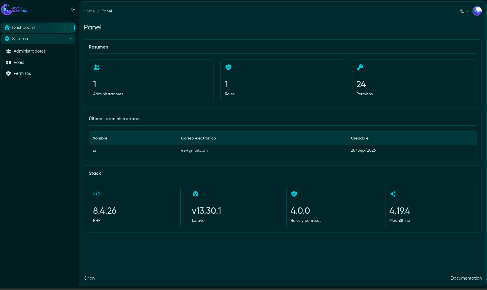

# Orion: Starter Kit for Laravel MoonShine 🚀

**Orion** is a starter project that speeds up the development of admin panels in Laravel using [MoonShine](https://moonshine-laravel.com/) as the admin framework.



## 📦 Main Technologies

| Package                     | Version | Description                  |
| --------------------------- | ------- | ---------------------------- |
| PHP                         | ^8.4.1  | Runtime                      |
| Laravel                     | v13     | Core PHP framework           |
| MoonShine                   | v4      | Admin panel                  |
| moonshine-roles-permissions | v4      | Roles and permissions system |

## ✨ Key Features

### 🛠 Base Configuration

-   Fully pre-configured MoonShine

### 🔐 Security

-   Integrated RBAC (Roles and Permissions) system
-   Command for automatic permission generation

### 🎨 Interface

-   Support for both English and Spanish

## 🧩 Modules

Logic lives in the modules, and each one is self-contained: drop the folder in and read its README.

-   **[MoonLaunch](./modules/MoonLaunch/README.md)** — core, not optional. Users, roles, permissions, dashboard, install commands and the resource traits.
-   **[MoonOrbit](./modules/MoonOrbit/README.md)** — optional, ships disabled. Settings, file manager, media library and activity log.

## 🚀 Installation

1. Clone the repository:

    ```bash
    git clone https://github.com/maycolmunoz/orion.git
    cd orion
    ```

2. Set up the environment:

    ```bash
    cp .env.example .env
    composer install
    npm install
    npm run build
    ```

3. Run the installer:
    ```bash
    php artisan launch:install
    ```

    Sets up the app key, migrations, permissions, the super admin role and the first user. See
    [MoonLaunch](./modules/MoonLaunch/README.md) for the details and for how to re-run any step.

4. Set up Laravel Boost:
    ```bash
    php artisan boost:install
    ```

    The installer will auto-detect your IDE and generate the appropriate configuration files and agent guidelines.

---

📘 **Additional Documentation**:

-   [moonshine](https://moonshine-laravel.com/docs)
-   [moonshine-roles-permissions](https://github.com/SWEET1S/moonshine-roles-permissions/)
